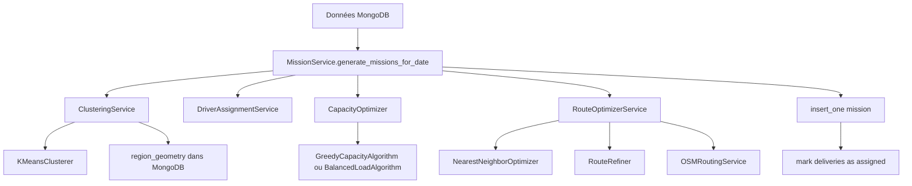
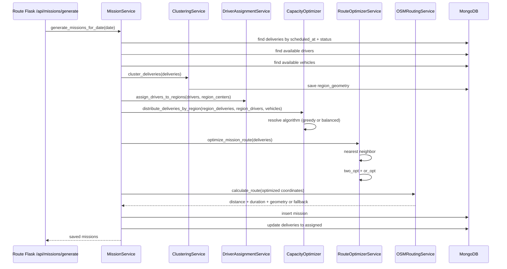

# SmartRoute - Optimisation des missions

Ce README documente le fonctionnement réel du module d'optimisation tel qu'il est implémenté dans le code source actuel. Il ne décrit pas un algorithme théorique: chaque étape ci-dessous correspond à une classe, une fonction ou une route effectivement présente dans le dépôt.

Note importante: le projet a été migré vers Flask. Les fichiers FastAPI encore présents dans `app/api/v1/` existent dans l'arborescence, mais l'application active est construite par `app.main:create_app()` et enregistre les blueprints Flask situés dans `app/routers/`.

## Objectif global

Le module d'optimisation a pour but de transformer un ensemble de livraisons planifiées en missions cohérentes. Concrètement, il cherche à:

- sélectionner les livraisons du jour à partir de `scheduled_at`;
- regrouper les livraisons en régions géographiques;
- associer les conducteurs aux régions;
- répartir les livraisons entre véhicules selon la capacité utile;
- ordonner les étapes pickup/delivery dans un ordre admissible;
- calculer une distance, une durée estimée et, si possible, une géométrie de route réelle;
- persister la mission et marquer les livraisons comme assignées.

L'algorithme est heuristique. Il ne résout pas un problème VRP global optimal. Il combine des méthodes simples, locales et déterministes quand possible, avec quelques paramètres de configuration en base.

## Vue d'ensemble de l'architecture

Le pipeline se décompose en quatre couches:

1. **Données et modèles**: livraisons, conducteurs, véhicules, missions, régions, paramètres d'optimisation.
2. **Algorithmes élémentaires**: clustering K-Means, affectation gloutonne, nearest neighbor, améliorations locales 2-opt / Or-opt.
3. **Services d'orchestration**: clustering, affectation des conducteurs, optimisation de route, gestion des réglages, génération de missions.
4. **Routes Flask**: exposition HTTP pour générer, simuler, consulter et mettre à jour les missions et les paramètres.



## Cartographie des fichiers et composants

### Entrée de l'application

- [app/main.py](app/main.py): crée l'application Flask, configure le JSON provider, connecte MongoDB, enregistre les blueprints et démarre le scheduler si nécessaire.
- [app/routers/missions.py](app/routers/missions.py): expose les routes liées à la génération, la simulation, la consultation et la mise à jour des missions.
- [app/routers/admin_optimization.py](app/routers/admin_optimization.py): expose les réglages des régions et l'activation des algorithmes de capacité.
- [app/routers/deliveries.py](app/routers/deliveries.py): route Flask de consultation des livraisons; son endpoint de liste accepte `paginate` et `scheduled_at`.
- [app/api/v1/deliveries.py](app/api/v1/deliveries.py): version FastAPI héritée, toujours présente mais non montée par `main.py`.

### Algorithmes purs

- [app/algorithms/__init__.py](app/algorithms/__init__.py): exporte les classes principales du package.
- [app/algorithms/kmeans.py](app/algorithms/kmeans.py): encapsule K-Means pour le clustering géographique.
- [app/algorithms/capacity_optimizer.py](app/algorithms/capacity_optimizer.py): choisit et exécute la stratégie d'affectation des livraisons aux véhicules.
- [app/algorithms/assignment_algorithms.py](app/algorithms/assignment_algorithms.py): définit l'interface d'affectation et implémente les stratégies gloutonne et équilibrée.
- [app/algorithms/nearest_neighbor.py](app/algorithms/nearest_neighbor.py): construit un ordre de visite local à partir de la distance Haversine.
- [app/algorithms/route_refiner.py](app/algorithms/route_refiner.py): améliore localement la route avec 2-opt et Or-opt.

### Services d'orchestration

- [app/services/clustering_service.py](app/services/clustering_service.py): calcule les centroïdes, lance le clustering et persiste la géométrie des régions.
- [app/services/driver_assignment_service.py](app/services/driver_assignment_service.py): affecte les conducteurs aux régions par proximité, ou en priorisant les régions les plus chargées dans la méthode avancée.
- [app/services/route_optimizer.py](app/services/route_optimizer.py): assemble les étapes pickup/delivery, lance nearest neighbor, puis les raffinements locaux.
- [app/services/osm_routing_service.py](app/services/osm_routing_service.py): appelle OSRM pour la route réelle et fournit des fallbacks Haversine.
- [app/services/optimization_settings_service.py](app/services/optimization_settings_service.py): lit et écrit les paramètres de régions et d'algorithmes en base.
- [app/services/mission_service.py](app/services/mission_service.py): orchestre la génération de missions de bout en bout et gère certaines opérations de lecture/mise à jour.

### Structures de données

- [app/models/delivery.py](app/models/delivery.py): structure métier d'une livraison.
- [app/models/driver.py](app/models/driver.py): structure métier d'un conducteur.
- [app/models/vehicle.py](app/models/vehicle.py): structure métier d'un véhicule.
- [app/models/mission.py](app/models/mission.py): structure métier d'une mission générée.
- [app/schemas/mission.py](app/schemas/mission.py): schémas Pydantic utilisés par les routes missions.
- [app/schemas/optimization.py](app/schemas/optimization.py): schémas Pydantic pour les réglages administrateur.

### Initialisation des collections

- [app/db/init_db.py](app/db/init_db.py): crée les collections, les validateurs JSON Schema, les index et injecte les valeurs par défaut pour `region_settings` et `algorithm_settings`.

## Structures de données utilisées

### Livraison

Une livraison contient notamment:

- `pickup_address`, `pickup_address_lat`, `pickup_address_lng`;
- `dropoff_address`, `dropoff_address_lat`, `dropoff_address_lng`;
- `weight_kg`;
- `priority`;
- `scheduled_at`;
- `status`;
- `vehicle_id` et `driver_id` éventuellement renseignés.

Le code d'optimisation ne fait pas de calcul sur la priorité, sauf pour le tri d'export éventuel dans d'autres parties du projet. Ici, le poids et les coordonnées sont les attributs décisifs.

### Conducteur

Les champs réellement exploités par l'optimisation sont:

- `availability`;
- `current_lat`, `current_lng`;
- `assigned_vehicle_id`.

### Véhicule

Les champs exploités sont:

- `capacity_kg`;
- `status`;
- `registration` ou `_id` selon le contexte.

### Mission

Une mission générée contient en pratique:

- `driver_id`, `vehicle_id`, `region_id`;
- `delivery_ids`;
- `deliveries_order`;
- `total_weight`;
- `route_distance`;
- `route_duration`;
- `status`;
- `polyline`;
- `created_at`, `scheduled_date`, `updated_at`.

Le modèle [app/models/mission.py](app/models/mission.py) existe sous forme de classe métier, tandis que [app/schemas/mission.py](app/schemas/mission.py) décrit la forme API. Les deux sont proches mais pas identiques.

## Déroulement complet de l'exécution

### 1. Sélection des livraisons à optimiser

Le chemin principal est [MissionService.generate_missions_for_date](app/services/mission_service.py). Si aucune date n'est fournie, il prend `datetime.utcnow()`.

Ensuite, [MissionService._get_deliveries_for_date](app/services/mission_service.py) sélectionne les livraisons avec:

- `scheduled_at` dans la journée cible;
- `status` dans `pending` ou `assigned`.

Les conducteurs disponibles sont lus via `availability = "available"` et les véhicules via `status = "available"`.

### 2. Clustering géographique

[ClusteringService.cluster_deliveries](app/services/clustering_service.py) construit d'abord un point représentatif pour chaque livraison:

- latitude du centroïde = moyenne entre pickup et dropoff;
- longitude du centroïde = moyenne entre pickup et dropoff.

Si des coordonnées manquent (pickup ou dropoff), la livraison est **exclue** du clustering (plus jamais approximée à `(0.0, 0.0)`) et collectée dans `deliveries_without_coordinates`. `cluster_deliveries` retourne désormais un tuple `(regions, deliveries_without_coordinates)`.

Le clustering s'appuie sur [KMeansClusterer.fit_predict](app/algorithms/kmeans.py). Ce clusterer:

- utilise `sklearn.cluster.KMeans`;
- est initialisé avec `n_init=10`;
- utilise, pour ce seul appel, `min(n_clusters, len(coordinates))` sans jamais muter durablement `self.n_clusters` (la valeur réellement utilisée est exposée via `self.last_effective_n_clusters`) — important si l'instance est réutilisée entre plusieurs lots de tailles différentes;
- retourne une liste de labels entiers.

Le nombre de clusters est résolu par [ClusteringService._resolve_n_clusters](app/services/clustering_service.py):

- si aucun `db` n'est fourni, la valeur de fallback est utilisée;
- si `region_settings` existe, `n_clusters` et `mode` viennent de la base;
- en mode `auto`, le nombre final est borné par le nombre de conducteurs disponibles;
- sinon la valeur configurée est conservée, avec un minimum de 1.

Le résultat est un dictionnaire `region_id -> liste de livraisons`.

### 3. Persistance de la géométrie des régions

Après le clustering, [ClusteringService._persist_region_geometry](app/services/clustering_service.py) stocke pour chaque région:

- `region_id`;
- `center_lat`, `center_lng`;
- `radius_km`;
- `computed_at`.

Le rayon est calculé comme le 90e percentile des distances Haversine entre le centre et les points du cluster.

Cette persistance n'a lieu que si `db` est présent.

### 4. Affectation des conducteurs aux régions

Dans le chemin principal de génération, [DriverAssignmentService.assign_drivers_to_regions](app/services/driver_assignment_service.py) est utilisé.

Pour chaque conducteur:

- le service lit `current_lat` et `current_lng`;
- si ces champs manquent, il tombe sur le premier centre de région;
- il calcule la distance Haversine à chaque centre;
- il affecte le conducteur à la région la plus proche.

Le service retourne un dictionnaire `region_id -> liste de conducteurs`.

Il existe aussi [DriverAssignmentService.optimize_driver_assignment](app/services/driver_assignment_service.py), qui est utilisé par la route `/api/missions/assign`:

- il calcule d'abord la charge de chaque région;
- il trie les régions par charge décroissante;
- il affecte d'abord le conducteur le plus proche aux régions les plus chargées;
- il affecte ensuite les conducteurs restants à la région la plus proche.

Cette méthode n'est pas utilisée par `MissionService.generate_missions_for_date`.

### 5. Répartition des livraisons par capacité

[CapacityOptimizer.distribute_deliveries_by_region](app/algorithms/capacity_optimizer.py) reçoit:

- les livraisons d'une région;
- les conducteurs assignés à cette région;
- la liste complète des véhicules.

Le service reconstruit d'abord les paires conducteur-véhicule via `assigned_vehicle_id`.

Ensuite, il calcule:

- la capacité totale disponible dans la région;
- le poids total des livraisons de la région.

Si le poids total dépasse la capacité, il logge un avertissement, mais ne bloque pas le traitement. Il délègue ensuite à [CapacityOptimizer.assign_deliveries_to_vehicles](app/algorithms/capacity_optimizer.py).

La stratégie d'affectation réelle est résolue par `_resolve_algorithm`:

- si `algorithm_name` a été fourni au constructeur, il prime;
- sinon, si une base est disponible, l'algorithme actif vient de `OptimizationSettingsService.get_active_algorithm()`;
- si rien n'est configuré, la stratégie par défaut est `GreedyCapacityAlgorithm`.

### 6. Stratégies d'affectation implémentées

#### GreedyCapacityAlgorithm

Fichier: [app/algorithms/assignment_algorithms.py](app/algorithms/assignment_algorithms.py)

Comportement réel:

- trie les livraisons par poids décroissant;
- initialise une liste d'assignments vide pour chaque paire conducteur-véhicule;
- pour chaque livraison, cherche l'assignment dont la capacité résiduelle après insertion est la plus petite possible tout en restant positive;
- si aucun véhicule ne peut porter la livraison, il logge un avertissement et laisse la livraison non affectée.

Cette stratégie cherche donc à remplir au plus juste les véhicules.

#### BalancedLoadAlgorithm

Fichier: [app/algorithms/assignment_algorithms.py](app/algorithms/assignment_algorithms.py)

Comportement réel:

- trie aussi les livraisons par poids décroissant;
- pour chaque livraison, évalue chaque assignment possible;
- calcule une variance projetée des charges après ajout de la livraison;
- choisit l'assignment qui minimise cette variance;
- en cas d'égalité quasi parfaite, il préfère le plus petit reste de capacité.

Cette stratégie vise à équilibrer les charges, pas à maximiser le remplissage.

### 7. Construction de la route

[RouteOptimizerService.optimize_mission_route](app/services/route_optimizer.py) reçoit la liste de livraisons d'un assignment.

Pour chaque livraison, il crée jusqu'à deux étapes:

- une étape `pickup` si les coordonnées de pickup existent;
- une étape `delivery` si les coordonnées de dropoff existent.

Si une coordonnée manque, l'étape correspondante n'est pas ajoutée.

Ensuite le service délègue l'ordonnancement à une **stratégie pluggable** (`RouteOptimizationStrategy`, résolue via `RouteOptimizerService.resolve_strategy()` — configuration admin si un `db` est fourni au constructeur, sinon `SavingsRouteStrategy` par défaut ; un appelant peut aussi forcer une stratégie précise via le paramètre `strategy` de `optimize_mission_route`). Voir la section "Stratégies d'ordonnancement de tournée (pluggable)" plus bas pour le détail des deux implémentations disponibles ([SavingsRouteStrategy](app/algorithms/route_strategies.py) et [ORToolsRouteStrategy](app/algorithms/ortools_strategy.py)).

Quelle que soit la stratégie, le contrat de retour est le même:

- `steps`: étapes ordonnées, chacune avec un champ `order` séquentiel à partir de 0, respectant la contrainte pickup avant delivery;
- `total_distance`: distance Haversine cumulée en km;
- `estimated_duration`: durée estimée en secondes à vitesse moyenne fixe de 30 km/h.

Le service ne fait pas appel à OSRM ici. Il travaille uniquement avec des distances Haversine pour l'ordonnancement local et l'estimation locale (OSRM intervient plus tard, voir section 11).

### 8. Optimisation de proximité dans Nearest Neighbor

[NearestNeighborOptimizer.optimize_route](app/algorithms/nearest_neighbor.py) applique une logique très simple:

- si la liste est vide, il renvoie `[]`;
- s'il n'y a qu'une étape, il la renvoie telle quelle;
- sinon il part du `start_location` si fourni, sinon du premier point de la liste;
- il parcourt les étapes non visitées et choisit la plus proche en Haversine;
- il interdit de prendre une étape `delivery` tant que le `pickup` correspondant est encore non visité.

Si aucune étape valide n'est trouvée, il logge un avertissement et arrête la boucle.

La méthode [calculate_total_distance](app/algorithms/nearest_neighbor.py) additionne les distances entre les étapes successives. Si `start_location` est fourni, la somme commence depuis ce point; sinon elle part du premier point et ajoute donc zéro pour la première étape.

### 9. Raffinement local de la route

[RouteRefiner](app/algorithms/route_refiner.py) applique deux heuristiques:

- `two_opt`: inversion de segment;
- `or_opt`: déplacement de segment court, de longueur 1 à 3.

Le raffinement:

- s'arrête si la route a moins de 3 étapes;
- limite le nombre de passes avec `max_iterations` (100 dans le service);
- accepte le premier mouvement qui améliore le coût;
- rejette tout candidat qui invalide l'ordre pickup/delivery.

La fonction `_route_cost` accepte deux formats de matrice:

- matrice de taille égale à la route;
- matrice avec un nœud de départ en plus.

Si la taille ne correspond pas à l'un de ces deux cas, elle lève une `ValueError`.

### 9bis. Stratégies d'ordonnancement de tournée (pluggable)

Sur le même modèle que `algorithm_settings` pour la capacité, l'ordonnancement de tournée est pluggable via l'interface [RouteOptimizationStrategy](app/algorithms/route_strategies.py) (`optimize(steps, start_location) -> {"steps", "total_distance", "estimated_duration"}`). Deux implémentations existent:

- **`clarke_wright`** — [SavingsRouteStrategy](app/algorithms/route_strategies.py), stratégie rapide et déterministe sans dépendance externe, et **fallback par défaut**. Elle construit une tournée par l'algorithme des économies de Clarke & Wright (fusion successive des paires de segments ayant le plus fort gain par rapport à un point de départ/dépôt, sous contrainte pickup-avant-delivery), construit aussi une tournée par plus-proche-voisin ([NearestNeighborOptimizer](app/algorithms/nearest_neighbor.py), conservé et encapsulé ici plutôt que supprimé), raffine les deux indépendamment avec [RouteRefiner](app/algorithms/route_refiner.py) (2-opt puis Or-opt, inchangé), et retourne la meilleure des deux — ce qui garantit que cette stratégie ne fait jamais pire que l'ancien pipeline fixe nearest-neighbor + 2-opt/Or-opt.
- **`ortools_cvrp`** — [ORToolsRouteStrategy](app/algorithms/ortools_strategy.py), résout la tournée comme un problème de tournée à un véhicule avec contrainte de précédence pickup-avant-delivery via `ortools.constraint_solver` (Google OR-Tools). Le paramètre `time_limit_seconds` (par défaut 5, lu depuis `self.parameters`) borne le temps de recherche. Si le solveur ne trouve aucune solution admissible dans ce délai, ou lève une exception, la stratégie logge un avertissement et bascule automatiquement sur `SavingsRouteStrategy`.

Résolution de la stratégie active:

- [OptimizationSettingsService.resolve_route_strategy](app/services/optimization_settings_service.py) lit la collection MongoDB dédiée `route_strategy_settings` (même schéma que `algorithm_settings`: `strategy_name`, `is_active`, `parameters`, `updated_by`, `updated_at` — une collection séparée plutôt qu'un champ `type` sur `algorithm_settings`, pour ne pas avoir à faire filtrer par type toute la logique existante de capacité). Sans configuration active ou sur un nom inconnu, elle retombe sur `SavingsRouteStrategy`.
- `RouteOptimizerService(db)` accepte un `db` optionnel (comme `CapacityOptimizer`); sans lui, il utilise toujours `SavingsRouteStrategy`.
- Routes admin (miroir de `/algorithms`): `GET /api/admin/optimization/route-strategies`, `POST /api/admin/optimization/route-strategies/activate`.
- `POST /api/missions/test-generate` accepte un `route_strategy` optionnel dans le corps pour forcer une stratégie de simulation sans toucher au réglage actif en base, et renvoie `route_strategy_used` et `route_optimization_time_ms` pour comparer objectivement les stratégies sur un même jeu de données.

### 10. Calcul de la route OSRM

[OSMRoutingService.calculate_route](app/services/osm_routing_service.py) intervient après l'optimisation locale, dans [MissionService._create_mission_from_assignment](app/services/mission_service.py).

Comportement réel:

- si moins de deux coordonnées sont fournies, il renvoie distance 0, durée 0, géométrie vide et étapes vides;
- sinon il appelle l'API OSRM `route/v1/driving`;
- si OSRM répond `Ok`, il renvoie la distance en kilomètres, la durée en secondes, la géométrie polyline et les legs de route;
- si la requête échoue ou si OSRM renvoie une erreur, il bascule sur un calcul de secours Haversine avec une vitesse moyenne de 30 km/h.

La méthode `calculate_matrix` existe aussi, mais elle n'est pas utilisée par le pipeline principal de génération de mission.

### 11. Création et persistance de la mission

[MissionService._create_mission_from_assignment](app/services/mission_service.py) prend un assignment et fabrique l'objet mission:

- `driver_id`, `vehicle_id`, `region_id`;
- `delivery_ids`;
- `deliveries_order`;
- `total_weight`;
- `route_distance`;
- `route_duration`;
- `status = planned`;
- `polyline`;
- `created_at`, `scheduled_date`, `updated_at`.

`POST /api/missions/assign` ([app/routers/missions.py](app/routers/missions.py)) réutilise désormais cette même méthode (ainsi que `_save_mission`) au lieu de dupliquer la construction de la mission — les trois routes de création de mission (`/generate`, `/test-generate`, `/assign`) appellent donc toutes OSRM et produisent une `polyline` réelle avec le même calcul de route. Voir « Audit Frontend Backend Contrat API » plus bas pour le détail de cette correction.

La mission est ensuite sauvegardée par [_save_mission](app/services/mission_service.py):

- suppression d'un éventuel `_id` dans le dict avant insertion;
- `insert_one` dans `db.missions`;
- si l'insertion réussit, les livraisons associées sont marquées `assigned` avec `driver_id` et `vehicle_id`;
- si l'insertion échoue, la mission n'est pas renvoyée.

### 12. Retour final de génération

`generate_missions_for_date` renvoie `{"missions": [...], "unassigned_delivery_ids": [...]}`.

> **Breaking change** : cette méthode renvoyait auparavant une simple liste de missions. `unassigned_delivery_ids` couvre à la fois les livraisons exclues par le clustering (coordonnées manquantes) et celles qui n'ont pu être affectées faute de conducteur/capacité disponible dans leur région. `POST /api/missions/generate` renvoie désormais ce même objet au lieu d'un tableau — tout client existant qui traitait la réponse comme un tableau doit être adapté.

Le chemin d'appel principal via [app/routers/missions.py](app/routers/missions.py) est:

- `POST /api/missions/generate`;
- le corps peut contenir `date` au format ISO;
- sinon la date courante est utilisée.

La route `/api/missions/test-generate` exécute la chaîne de calcul sans forcément persister les missions et renvoie un résumé de simulation.

## Algorithmes et heuristiques utilisés

### Clustering

Algorithme: K-Means via scikit-learn.

Application réelle:

- on clusterise des centroïdes de livraisons;
- le nombre de clusters dépend de `region_settings` ou du fallback de service;
- si le nombre de points est inférieur au nombre de clusters demandé, K-Means est réinitialisé à un nombre plus petit.

### Affectation de capacité

Algorithmes:

- `GreedyCapacityAlgorithm`;
- `BalancedLoadAlgorithm`.

Application réelle:

- les livraisons sont triées par poids décroissant;
- on ne fait pas de backtracking global;
- une livraison qui ne rentre dans aucun véhicule reste non affectée et déclenche un avertissement.

### Ordonnancement de tournée

Algorithmes:

- nearest neighbor;
- 2-opt;
- Or-opt.

Application réelle:

- nearest neighbor produit une route admissible rapidement;
- 2-opt et Or-opt essaient d'améliorer localement le coût;
- aucune de ces heuristiques ne garantit un optimum global.

### Contraintes

Contraintes réellement appliquées:

- pickup avant delivery pour chaque `delivery_id`;
- capacité véhicule non dépassée dans les stratégies d'assignation;
- sélection des livraisons du jour par `scheduled_at`;
- conducteurs et véhicules doivent être disponibles pour entrer dans le flux principal.

Contraintes non implémentées:

- fenêtres temporelles de livraison;
- trafic en temps réel;
- temps de service sur site;
- contraintes de multi-dépôt;
- optimisation globale exacte.

## Règles métier et cas particuliers

- Si aucun delivery n'est trouvé pour la date cible, la génération renvoie une liste vide.
- Si aucun conducteur n'est disponible, la génération renvoie une liste vide.
- Si aucun véhicule n'est disponible, la génération renvoie une liste vide.
- Si un delivery n'a pas toutes ses coordonnées, les étapes manquantes ne sont pas créées.
- Si l'appel OSRM échoue, le système produit quand même une distance et une durée de secours.
- Si aucun algorithme actif n'est configuré en base, `greedy_capacity` devient le fallback.
- Si `mode = auto` dans les réglages de régions, `n_clusters` est limité au nombre de conducteurs disponibles.
- Si on réduit `n_clusters`, les régions et missions au-delà de cette borne sont nettoyées ou neutralisées par `OptimizationSettingsService.update_region_settings`.

## Séquence d'exécution réelle



## Exemple complet d'exécution

Exemple volontairement simple pour rendre le comportement lisible. On suppose:

- `region_settings.n_clusters = 1`;
- l'algorithme actif est `greedy_capacity`;
- un conducteur est disponible et possède un véhicule de 500 kg;
- deux livraisons sont planifiées pour le jour courant;
- OSRM est indisponible, donc le fallback Haversine est utilisé pour la route finale.

### Données d'entrée

```json
{
	"deliveries": [
		{
			"_id": "d1",
			"scheduled_at": "2026-08-05T09:00:00Z",
			"status": "pending",
			"weight_kg": 100,
			"pickup_address_lat": 0.0,
			"pickup_address_lng": 0.0,
			"dropoff_address_lat": 0.0,
			"dropoff_address_lng": 1.0
		},
		{
			"_id": "d2",
			"scheduled_at": "2026-08-05T09:00:00Z",
			"status": "pending",
			"weight_kg": 150,
			"pickup_address_lat": 0.0,
			"pickup_address_lng": 2.0,
			"dropoff_address_lat": 0.0,
			"dropoff_address_lng": 3.0
		}
	],
	"drivers": [
		{
			"_id": "drv-1",
			"availability": "available",
			"current_lat": 0.0,
			"current_lng": 0.0,
			"assigned_vehicle_id": "veh-1"
		}
	],
	"vehicles": [
		{
			"_id": "veh-1",
			"status": "available",
			"capacity_kg": 500
		}
	]
}
```

### Traitements effectués

1. Le service sélectionne les deux livraisons car `scheduled_at` est dans la journée cible et `status` vaut `pending`.
2. Chaque livraison est convertie en centroïde. Comme pickup et dropoff sont sur la même latitude, les centroïdes sont `(0.0, 0.5)` et `(0.0, 2.5)`.
3. K-Means reçoit ces deux points. Avec `n_clusters = 1`, les deux livraisons restent dans la même région.
4. Le conducteur est affecté à cette région, car il est le seul disponible.
5. `greedy_capacity` trie les livraisons par poids décroissant et les place toutes les deux sur `veh-1`, car la capacité totale reste suffisante.
6. `RouteOptimizerService` crée quatre étapes: pickup d1, delivery d1, pickup d2, delivery d2.
7. Nearest neighbor choisit l'ordre le plus proche en respectant pickup avant delivery:
	 - pickup d1;
	 - delivery d1;
	 - pickup d2;
	 - delivery d2.
8. `RouteRefiner` teste 2-opt puis Or-opt, mais ne trouve pas d'amélioration admissible.
9. `OSMRoutingService` échoue dans cet exemple et retourne la fallback distance Haversine.
10. La mission est insérée en base et les deux livraisons passent en `assigned`.

### Résultat obtenu

La mission contient au minimum:

- `driver_id = drv-1`;
- `vehicle_id = veh-1`;
- `region_id = 0`;
- `delivery_ids = [d1, d2]`;
- `deliveries_order` avec 4 étapes et des `order` de 0 à 3;
- `status = planned`;
- `scheduled_date` renseigné à la date cible.

Avec ce jeu de coordonnées et le fallback Haversine, la distance totale est d'environ `333.6 km` et la durée estimée est d'environ `40030 s` si l'on garde la vitesse moyenne codée à `30 km/h`.

## Limites actuelles

Les limites ne sont pas masquées dans le code, il faut les considérer comme réelles:

- `NearestNeighborOptimizer` est une heuristique gloutonne locale, pas un solveur exact.
- `RouteRefiner` effectue seulement des améliorations locales limitées par `max_iterations`.
- Le calcul de durée repose sur une vitesse moyenne fixe de 30 km/h.
- Il n'existe pas de gestion des fenêtres horaires de livraison.
- Le trafic, la congestion et les temps d'arrêt ne sont pas intégrés.
- La route réelle OSRM n'est utilisée qu'après l'ordonnancement local, pas pour choisir l'ordre des étapes.
- `calculate_matrix` dans `OSMRoutingService` est implémentée mais non utilisée par le pipeline principal.
- `assign_delivery_to_region` dans `ClusteringService` existe, mais le chemin principal de génération utilise l'affectation des conducteurs aux régions, pas cette méthode isolée.
- `validate_route_constraints` existe, mais elle n'est pas appelée automatiquement après optimisation.
- La génération principale ne fait pas de replanification si une livraison ne peut pas être affectée; elle se contente de la laisser de côté et d'émettre un log.

## Pistes d'amélioration possibles

Ces pistes ne sont pas implémentées à ce jour, mais elles découleraient naturellement des limites visibles dans le code:

- introduire une vraie optimisation de type VRP avec contraintes de capacité et d'ordre;
- intégrer des fenêtres temporelles et les temps de service;
- utiliser OSRM ou un moteur de matrice de distance dès la phase d'ordonnancement local;
- ajouter un backtracking ou une stratégie de repli quand une livraison reste non affectée;
- exposer un mode de validation explicite qui appelle `validate_route_constraints` avant persistance;
- faire remonter les livraisons non assignées dans la réponse de génération;
- ajouter des tests d'intégration sur les routes Flask actives;
- documenter séparément les routes FastAPI héritées si elles doivent rester dans l'arbre source.

## Réglages administrateur

Les réglages qui influencent réellement le module sont gérés par [app/routers/admin_optimization.py](app/routers/admin_optimization.py) et [app/services/optimization_settings_service.py](app/services/optimization_settings_service.py).

### Région

- `GET /api/admin/optimization/region-settings`
- `PUT /api/admin/optimization/region-settings`

Le `PUT` valide `n_clusters` et `mode`, puis met à jour `region_settings`.

### Algorithme de capacité

- `GET /api/admin/optimization/algorithms`
- `POST /api/admin/optimization/algorithms/activate`

L'algorithme actif est stocké dans `algorithm_settings`. Si le nom activé est inconnu au code, le système retombe sur `greedy_capacity`.

## Points à retenir

- Le comportement réel est en Python synchrone avec Flask et PyMongo.
- Le filtrage opérationnel se fait sur `scheduled_at`, pas sur un pseudo champ de date abstrait.
- L'optimisation est une chaîne de heuristiques simples, pas un moteur d'optimisation globale.
- Le flux principal persiste les missions et marque les livraisons comme assignées.
- Les fichiers FastAPI restants sont des reliques du passé de l'application et ne représentent pas le chemin actif.

## Audit Frontend Backend Contrat API

Audit mené le 2026-08-10 sur le frontend `smartroute/` (dossier `src/components/optimization/`, `src/services/optimizationService.js`, `src/services/missionService.js`) face à ce backend, pour vérifier l'absence de conflit sur les endpoints d'optimisation/missions. Une première passe a trouvé et corrigé 2 conflits ; une seconde passe (même date) a traité les points restés en simple « précaution » lors de la première passe — ils sont désormais corrigés eux aussi (7 corrections au total). Voir aussi la documentation frontend correspondante : [`smartroute/src/components/optimization/README.md`](../smartroute/src/components/optimization/README.md).

### Contrat API — endpoints d'optimisation et de missions

| Méthode | Route backend (blueprint) | Fonction frontend | Corps envoyé | Forme de la réponse |
|---|---|---|---|---|
| GET | `/api/admin/optimization/region-settings` | `getRegionSettings()` | — | `{ n_clusters, mode, updated_by, updated_at }` |
| PUT | `/api/admin/optimization/region-settings` | `updateRegionSettings({mode, n_clusters})` | `{ mode: 'fixe'\|'auto', n_clusters: int\|null }` | idem GET |
| GET | `/api/admin/optimization/algorithms` | `getOptimizationAlgorithms()` | — | `{ items: [{ algorithm_name, is_active, parameters, updated_at, updated_by }] }` |
| POST | `/api/admin/optimization/algorithms/activate` | `activateOptimizationAlgorithm({algorithm_name, parameters})` | `{ algorithm_name: str, parameters: object }` | document `algorithm_settings` mis à jour |
| GET | `/api/admin/optimization/route-strategies` | `getRouteStrategies()` | — | `{ items: [{ strategy_name, is_active, parameters, updated_at, updated_by }] }` |
| POST | `/api/admin/optimization/route-strategies/activate` | `activateRouteStrategy({strategy_name, parameters})` | `{ strategy_name: str, parameters: object }` | document `route_strategy_settings` mis à jour |
| GET | `/api/regions/geometry` | `getRegionsGeometry()` | — | GeoJSON `FeatureCollection` (`Point` par région, `properties: {region_id, radius_km, computed_at}`) |
| POST | `/api/missions/generate` | `generateMissions()` | `{}` (le champ optionnel `date` existe côté backend mais n'est jamais envoyé par ce frontend) | `{ missions: [...], unassigned_delivery_ids: [str] }` |
| POST | `/api/missions/test-generate` | `testGenerateMissions({date?, route_strategy?, route_strategy_parameters?})` | seules les clés fournies sont envoyées | `{ success, total_deliveries, total_drivers_assigned, total_distance, total_assignments, assigned_deliveries?, route_strategy_used?, route_optimization_time_ms?, simulation_run_id?, assignments: [{region_id, driver_id, vehicle_id, delivery_count, total_weight, route_distance, estimated_duration, delivery_ids, deliveries_order}] }` |
| POST | `/api/missions/assign` | *(aucun appelant frontend actuel)* | `{ delivery_ids?: [str] }` | `{ success, total_deliveries, total_assignments, assigned_deliveries, unassigned_deliveries, unassigned_delivery_ids, n_clusters, assignments: [{..., polyline}] }` |
| GET | `/api/missions/today` | `getTodayMissions()` (`missionService.js`) | — | `{ items: [Mission] }` |
| GET | `/api/missions/driver/<id>/today` | `fetchTodayMissions(driverId)` | — | `{ items: [Mission], total, page, limit }` |
| PATCH | `/api/missions/<id>/step` | `updateMissionStep(id, stepIndex, isDone)` | `{ step_index: int, is_done: bool }` | Mission sérialisée |

Toutes les routes `/api/missions/*`, `/api/admin/optimization/*` et `/api/regions/geometry` exigent désormais un JWT valide (`@require_auth`, ou `@require_admin` pour `/api/admin/optimization/*`) et renvoient les erreurs métier au format `{"detail": "..."}` (ou `{"detail": [{"loc": [...], "msg": "...", "type": "..."}]}` pour les erreurs de validation — voir ci-dessous), consommé par `getApiErrorMessage()` côté frontend (`src/utils/apiError.js`).

Les préfixes de blueprint ne sont **pas uniformes** dans ce backend : `missions`, `admin_optimization` et `regions` sont montés sous `/api/...` alors que la majorité des autres ressources (`auth`, `deliveries`, `drivers`, `vehicles`, `users`, `routes`, `locations`, `tracking`) sont montées sous `/api/v1/...` (voir `url_prefix` dans `app/routers/*.py`). Côté frontend, `src/services/apiBaseUrl.js::getApiRootBaseUrl()` centralise la résolution de la base `/api` (sans `/v1`) utilisée par `optimizationService.js`/`missionService.js`, dérivée de `VITE_API_BASE_URL` en lui retirant un `/v1` final — voir « Précautions » plus bas.

### Conflits trouvés et corrigés

#### 1. Erreurs de validation illisibles côté frontend

1. **Où** : Backend, [`app/dependencies.py::parse_body`](app/dependencies.py).
2. **Pourquoi le conflit** : `parse_body` est appelé par toutes les routes qui valident un corps JSON avec Pydantic, y compris `PUT /api/admin/optimization/region-settings`, `POST /api/admin/optimization/algorithms/activate` et `POST /api/admin/optimization/route-strategies/activate`. En cas d'erreur, il levait `APIException(422, str(exc.errors()))` — `str()` transforme la liste d'erreurs Pydantic en un texte Python brut (`"[{'type': 'greater_than_equal', 'loc': ('n_clusters',), ...}]"`). Or `getApiErrorMessage()` côté frontend ([`src/utils/apiError.js`](../smartroute/src/utils/apiError.js)) contient un branchement explicite `Array.isArray(detail)` pour reformater proprement une vraie liste d'erreurs Pydantic (`item.msg`, `item.loc.join('.')`) — branchement qui n'était **jamais atteint** puisque `detail` était toujours une chaîne.
3. **Comportement Frontend actuel (avant correction)** : code prêt à afficher un message clair par champ, mais jamais déclenché faute d'un vrai tableau JSON en entrée.
4. **Comportement Backend actuel (avant correction)** : renvoie `{"detail": "[{'type': 'greater_than_equal', 'loc': ('n_clusters',), 'msg': 'Input should be greater than or equal to 1', ...}]"}` — une chaîne illisible affichée telle quelle à l'utilisateur (ex. en soumettant `n_clusters = 0` dans `RegionSettingsPanel`, bien que ce cas précis soit déjà bloqué côté UI par `isClusterValid`, tout autre 422 backend — activation d'algorithme, etc. — passait par le même chemin).
5. **Comportement attendu** : `detail` doit être un tableau JSON de `{loc, msg, type}` exploitable directement par le code frontend existant, sans rien changer côté frontend.
6. **Solution appliquée** : `parse_body` construit désormais explicitement `[{"loc": list(err["loc"]), "msg": err["msg"], "type": err["type"]} for err in exc.errors()]` et le passe à `APIException`. `APIException.detail` (dans [`app/core/exceptions.py`](app/core/exceptions.py)) est retypé `Any` (il n'était utilisé qu'à un seul endroit, `app/main.py::handle_api_exception`, qui se contente de le passer à `jsonify` — donc aucun autre appelant à adapter). Correction purement backend, aucun changement requis côté frontend.

#### 2. Algorithmes d'affectation documentés côté frontend qui n'existent pas côté backend

1. **Où** : Frontend, [`src/components/optimization/AssignmentAlgorithmPanel.jsx`](../smartroute/src/components/optimization/AssignmentAlgorithmPanel.jsx) (et sa documentation, `src/components/optimization/README.md`).
2. **Pourquoi le conflit** : la constante `DESCRIPTION_MAP` associait des descriptions à quatre clés — `clustering`, `hungarian`, `greedy`, `balanced`. Or le backend n'implémente et ne sert que deux algorithmes d'affectation, sous des noms différents : `greedy_capacity` et `balanced_load` (classes `GreedyCapacityAlgorithm`/`BalancedLoadAlgorithm` dans [`app/algorithms/assignment_algorithms.py`](app/algorithms/assignment_algorithms.py), seedées dans `algorithm_settings` par [`app/db/init_db.py`](app/db/init_db.py)). Aucune trace de `clustering` ou `hungarian` comme `algorithm_name` nulle part dans le backend. `GET /api/admin/optimization/algorithms` ne renvoie donc jamais ces clés, si bien que `DESCRIPTION_MAP[algorithm.algorithmName.toLowerCase()]` ne matchait jamais et retombait systématiquement sur le texte générique `"Aucune description fournie."`.
3. **Comportement Frontend actuel (avant correction)** : panneau fonctionnel (les deux vrais algorithmes s'affichent et s'activent correctement), mais sans jamais afficher de description utile — les quatre libellés soignés de `DESCRIPTION_MAP` étaient du code mort.
4. **Comportement Backend actuel** : sert uniquement `greedy_capacity` et `balanced_load` ; toute tentative d'activer `clustering`/`hungarian`/`greedy`/`balanced` échouerait avec un 404 (`OptimizationSettingsService.activate_algorithm`), mais ce cas n'était de toute façon jamais atteignable depuis l'UI puisque la liste vient de `GET .../algorithms`.
5. **Comportement attendu** : les clés de `DESCRIPTION_MAP` doivent correspondre exactement aux `algorithm_name` réellement servis par le backend, pour que la description utile s'affiche.
6. **Solution appliquée** : `DESCRIPTION_MAP` utilise désormais `greedy_capacity` et `balanced_load` avec des descriptions alignées sur le comportement réel des deux classes (remplissage au plus juste vs. minimisation de l'écart de charge). Le tableau des algorithmes dans `src/components/optimization/README.md` (section « Algorithmes utilisés ») a été corrigé de la même façon. Aucun changement métier : ce sont les deux mêmes algorithmes qui tournaient déjà côté backend, seule l'étiquette affichée change.

#### 3. `POST /api/missions/assign` ne calculait pas de route réelle

1. **Où** : Backend, [`app/routers/missions.py::assign_deliveries`](app/routers/missions.py).
2. **Pourquoi le conflit** : cette route dupliquait à la main la construction du dict de mission au lieu de réutiliser `MissionService._create_mission_from_assignment` (utilisée par `/generate` et `/test-generate`), et n'appelait donc jamais `OSMRoutingService`. `route_distance`/`estimated_duration` venaient uniquement de l'estimation Haversine du `RouteOptimizerService`, et `polyline` était toujours `None` en base — alors que rien dans le contrat (schéma, nom de champ) n'indiquait cette différence entre routes de génération de missions.
3. **Comportement Frontend actuel** : aucun appelant dans `smartroute/` actuellement (voir tableau ci-dessus), donc pas de rupture visible aujourd'hui — mais tout futur écran s'appuyant sur cette route aurait hérité de missions sans tracé réel, contrairement à `/generate`.
4. **Comportement Backend actuel (avant correction)** : `polyline: null` systématique, distance/durée Haversine uniquement.
5. **Comportement attendu** : les trois routes de création de mission (`/generate`, `/test-generate`, `/assign`) doivent produire des missions au même format, avec le même calcul de route (OSRM avec repli Haversine).
6. **Solution appliquée** : `assign_deliveries` instancie désormais `MissionService(db)` et réutilise `_create_mission_from_assignment`/`_save_mission` pour chaque assignation, au lieu de reconstruire son propre dict et son propre `insert_one`. La réponse gagne un champ `polyline` par assignation (auparavant absent) ; les autres champs de réponse existants sont inchangés. Testé par `test_assign_deliveries_route_computes_real_route_via_osrm` (`tests/test_missions_route.py`).

#### 4. `region_settings.n_clusters` réinitialisé à `5` en mode auto

1. **Où** : Backend, [`app/services/optimization_settings_service.py::update_region_settings`](app/services/optimization_settings_service.py).
2. **Pourquoi le conflit** : `RegionSettingsPanel.jsx` désactive le champ `nClusters` et envoie `n_clusters: null` quand `mode = "auto"` (comportement frontend volontaire). Le backend traitait `n_clusters is None` comme « valeur non fournie » et retombait sur un `5` codé en dur, écrasant silencieusement toute valeur précédemment configurée en mode `fixe`.
3. **Comportement Frontend actuel** : envoie bien `n_clusters: null` en mode auto, comme prévu — le frontend ne fait rien de travers ici.
4. **Comportement Backend actuel (avant correction)** : `n_clusters` retombait toujours à `5`, quelle que soit la valeur précédente.
5. **Comportement attendu** : en l'absence de valeur explicite, le backend doit conserver la dernière valeur connue plutôt que d'imposer une constante arbitraire.
6. **Solution appliquée** : `update_region_settings` lit désormais les réglages existants en premier et utilise `existing.get("n_clusters", 5)` comme valeur de repli (au lieu de `5` en dur) quand `n_clusters` n'est pas fourni. `5` reste le repli uniquement au tout premier enregistrement. Testé par `test_update_region_settings_auto_mode_without_value_keeps_previous_n_clusters` et `test_update_region_settings_defaults_to_five_when_never_configured` (`tests/test_optimization_settings.py`).

#### 5. Aucune authentification sur `/api/missions/*`

1. **Où** : Backend, [`app/routers/missions.py`](app/routers/missions.py) ; Frontend, [`src/services/missionService.js`](../smartroute/src/services/missionService.js).
2. **Pourquoi le conflit** : `/api/admin/optimization/*` exige `@require_admin` et `/api/regions/geometry` exige `@require_auth`, mais aucune route de `missions_bp` n'avait de décorateur — n'importe qui pouvait générer/assigner des missions ou lire les missions de n'importe quel conducteur sans être connecté. En creusant, `updateMissionStep()` (frontend) envoyait déjà un header `Authorization`, mais en lisant `localStorage.getItem('token')` — une clé que rien dans l'application ne renseigne jamais (le vrai jeton est stocké sous `smartroute_token` par `tokenService.js`) : ce header valait donc toujours `"Bearer null"`.
3. **Comportement Frontend actuel (avant correction)** : `getTodayMissions()`/`fetchTodayMissions()` n'envoyaient aucun header d'authentification ; `updateMissionStep()` en envoyait un, mais construit à partir d'une clé `localStorage` jamais définie.
4. **Comportement Backend actuel (avant correction)** : acceptait toute requête sur `/api/missions/*` sans vérifier de jeton.
5. **Comportement attendu** : cohérence avec le reste de l'API — toute route qui expose ou modifie des données métier doit exiger un utilisateur authentifié.
6. **Solution appliquée** : toutes les routes de `missions_bp` portent désormais `@require_auth`. Côté frontend, `getTodayMissions()` et `fetchTodayMissions()` envoient maintenant `Authorization: Bearer <token>` via `getToken()` (`tokenService.js`), et `updateMissionStep()` utilise la même fonction au lieu de la mauvaise clé `localStorage`. Vérifié que les trois pages qui consomment ces fonctions (`DashboardPage`, `DriverMissionPage`, `OptimizationPage`) sont déjà toutes derrière `ProtectedRoute` (`src/routes/AppRouter.jsx`), donc un jeton est toujours disponible au moment de l'appel. Aucun autre client de cette API n'a été trouvé dans le dépôt (`ML/`, `data/`, `project/`, `rapport/`, `simulator tracker/`) ; le scheduler interne (`app/services/scheduler_service.py`) appelle `MissionService` directement en Python, pas via HTTP, donc n'est pas concerné. Tests direct-call adaptés dans `tests/test_missions_route.py` (fixture `_authenticated_request` qui stub `get_current_user`).

#### 6. `decodePolyline`/`fetchOsrmRoute` dupliqués côté frontend

1. **Où** : Frontend, [`src/services/missionService.js`](../smartroute/src/services/missionService.js).
2. **Pourquoi le conflit** : ce n'était pas un désaccord avec le backend, mais un risque de divergence interne au frontend — `missionService.js` maintenait sa propre copie de `decodePolyline`/`fetchOsrmRoute`, séparée de `src/utils/polylineDecoder.js`/`src/services/osrmService.js`. Les deux implémentations de `decodePolyline` se sont révélées mathématiquement équivalentes (vérifié sur le vecteur de test standard de l'algorithme Google Polyline), mais celle de `missionService.js` pour `fetchOsrmRoute` ignorait `VITE_OSRM_URL` (hôte OSRM codé en dur sur le serveur de démo public) et ne gérait pas le cas à un seul point, contrairement à la version de `osrmService.js`.
3. **Comportement Frontend actuel (avant correction)** : `DriverMap.jsx` importait `fetchOsrmRoute`/`decodePolyline` depuis `missionService.js` (la copie moins complète) ; `useMissionsWithRoutes.js` importait les mêmes fonctions depuis `osrmService.js`/`polylineDecoder.js` (la version canonique) — deux composants du même frontend pouvaient donc en théorie diverger en cas de futur correctif appliqué à un seul des deux fichiers.
4. **Comportement Backend actuel** : sans objet (fix purement frontend).
5. **Comportement attendu** : une seule implémentation par fonction, réutilisée partout.
6. **Solution appliquée** : `missionService.js` ré-exporte désormais `decodePolyline`/`fetchOsrmRoute` depuis `utils/polylineDecoder.js`/`services/osrmService.js` au lieu de les redéfinir — `DriverMap.jsx` n'a pas eu besoin d'être modifié (même chemin d'import). Vérifié par `npx vite build` (194 modules, aucune erreur) et `npx oxlint`.

#### 7. `VITE_API_BASE_URL`/`VITE_API_BASE_URLL` : risque de divergence

1. **Où** : Frontend, [`src/services/optimizationService.js`](../smartroute/src/services/optimizationService.js), [`src/services/missionService.js`](../smartroute/src/services/missionService.js).
2. **Pourquoi le conflit** : les deux variables sont nécessaires (voir plus haut, préfixes de blueprint mixtes), mais rien ne garantissait qu'elles restent cohérentes entre elles à travers les environnements — mettre à jour `VITE_API_BASE_URL` sans mettre à jour `VITE_API_BASE_URLL` (ou l'inverse) aurait fait retomber silencieusement une partie de l'API sur `http://localhost:8000/...`, sans erreur immédiate.
3. **Comportement Frontend actuel (avant correction)** : deux constantes lues indépendamment dans deux fichiers différents, sans lien entre elles.
4. **Comportement Backend actuel** : sans objet (fix purement frontend, la cause racine — préfixes mixtes — reste côté backend et n'a pas été changée pour ne pas casser les intégrations existantes).
5. **Comportement attendu** : une seule source de vérité, avec une valeur dérivée automatiquement plutôt que deux valeurs à synchroniser manuellement.
6. **Solution appliquée** : nouveau module [`src/services/apiBaseUrl.js`](../smartroute/src/services/apiBaseUrl.js) exportant `getApiRootBaseUrl()`, qui dérive la base `/api` à partir de `VITE_API_BASE_URL` (en retirant un `/v1` final) si `VITE_API_BASE_URLL` n'est pas explicitement définie — `VITE_API_BASE_URLL`, quand elle existe, garde la priorité pour ne rien casser dans les environnements déjà configurés (dont le `.env` actuel de ce dépôt). `optimizationService.js` et `missionService.js` utilisent désormais cette fonction au lieu de lire `import.meta.env.VITE_API_BASE_URLL` directement.

### Points vérifiés sans conflit trouvé

- **Méthodes HTTP** : toutes les routes consommées par le frontend (`GET`/`PUT`/`POST`/`PATCH`) correspondent exactement aux méthodes déclarées côté blueprint Flask.
- **Stratégies de tournée** : `clarke_wright` et `ortools_cvrp` existent bien des deux côtés avec les mêmes noms (`SavingsRouteStrategy.strategy_name`, `ORToolsRouteStrategy.strategy_name`), contrairement aux algorithmes d'affectation ci-dessus.
- **Workflow test vs génération définitive** : `POST /api/missions/test-generate` (→ `MissionService.simulate_missions_for_date`) et `POST /api/missions/generate` (→ `MissionService.generate_missions_for_date`) partagent le même pipeline de construction (`_build_mission_drafts`) et ne diffèrent que par la persistance : le test écrit dans `mission_simulations` (jamais lu par le frontend, ce qui est cohérent : `simulation_run_id` n'est utilisé que pour traçabilité, pas pour être re-fetché) et ne touche jamais `deliveries`/`missions` ; la génération définitive écrit dans `missions` et marque les livraisons `assigned`. Le frontend respecte cette distinction : `testGenerateMissions()` ne met à jour que `testResult` (affichage), `generateMissions()` seul déclenche un rafraîchissement supposant un état serveur changé.
- **Champs de réponse consommés par `useMissionsWithRoutes`/`MissionRoute`** (`driver._id`, `deliveries_order[].order/lat/lng/step_type`, `polyline`, `route_distance`, `route_duration`, `total_weight`, `region_id`, `status`) : tous présents et correctement typés dans `_serialize_mission`/`MissionStepSchema`.
- **Appels API dupliqués** : aucun appel redondant identifié — chaque panneau de `OptimizationPage.jsx` charge une ressource distincte au montage ; `StrategyComparisonPanel` et `RegionMapView` utilisent tous deux `testGenerateMissions()` mais avec des usages différents et non redondants (comparaison sur stratégie forcée vs test de la configuration active).

### Workflow complet (Frontend → API → Backend → Optimisation → Base de données → Réponse API → Frontend)

```
1. RegionMapView (Frontend)
   → clic « Tester l'algorithme » ou « Valider la génération »
2. optimizationService.testGenerateMissions() / generateMissions() (Frontend)
   → POST /api/missions/test-generate | POST /api/missions/generate  (Backend, app/routers/missions.py)
3. MissionService.simulate_missions_for_date() / generate_missions_for_date()  (Backend)
   → _build_mission_drafts() :
        ClusteringService.cluster_deliveries()        (Optimisation : K-Means)
        DriverAssignmentService.assign_drivers_to_regions()
        CapacityOptimizer.distribute_deliveries_by_region()  (greedy_capacity | balanced_load)
        RouteOptimizerService.optimize_mission_route()       (clarke_wright | ortools_cvrp)
        OSMRoutingService.calculate_route()                  (OSRM, avec repli Haversine)
4. Base de données MongoDB
   test-generate → collection `mission_simulations` (aucune écriture dans `missions`/`deliveries`)
   generate      → collection `missions` (insert_one) + `deliveries` passées à `assigned`
   (les deux écrivent aussi `region_geometry`, recalculée à chaque clustering)
5. Réponse API (Backend → Frontend)
   test-generate → { success, total_distance, total_assignments, assignments: [...], ... }
   generate      → { missions: [...], unassigned_delivery_ids: [...] }
6. Frontend
   testResult / generateResult mis à jour → affichage des métriques ou de l'avertissement
   « X livraison(s) non affectée(s) » → refreshMapData() recharge géométrie + livraisons
```

### Précautions pour éviter de nouveaux conflits

- **Ne jamais ajouter un nouvel algorithme/stratégie d'un seul côté** : un `algorithm_name`/`strategy_name` doit exister simultanément dans `app/algorithms/*.py` (+ seed dans `app/db/init_db.py` si on veut qu'il apparaisse par défaut) et dans les constantes d'affichage frontend (`DESCRIPTION_MAP` dans `AssignmentAlgorithmPanel.jsx`, `STRATEGY_LABELS`/`STRATEGY_DESCRIPTIONS` dans `RouteStrategyPanel.jsx`, `STRATEGIES` dans `StrategyComparisonPanel.jsx`). Le frontend affiche toujours ce que `GET .../algorithms` ou `.../route-strategies` renvoie ; seules les *descriptions* dépendent d'un mapping local qui peut diverger silencieusement (c'est exactement ce qui s'est produit ici).
- **`parse_body` (`app/dependencies.py`) est le seul point qui doit lever des erreurs de validation** pour toutes les routes admin/missions/deliveries/etc. : garder `detail` comme tableau JSON de `{loc, msg, type}` (jamais `str(...)`) pour rester compatible avec `getApiErrorMessage()` côté frontend.
- **Toute nouvelle route de `missions_bp` doit porter `@require_auth`** (ou `@require_admin` si elle est réservée aux administrateurs) — c'est désormais la norme pour l'ensemble du blueprint, pas seulement `/api/admin/optimization/*` et `/api/regions/geometry`. Si un appel frontend est ajouté vers une route protégée, utiliser `getToken()` (`src/services/tokenService.js`) — jamais une clé `localStorage` ad hoc (`updateMissionStep()` a longtemps envoyé un jeton toujours nul à cause de ça).
- **La base URL `/api` (sans `/v1`) côté frontend passe désormais par `src/services/apiBaseUrl.js::getApiRootBaseUrl()`**, pas par une lecture directe de `import.meta.env`. Tout nouveau service qui appelle `admin_optimization`/`missions`/`regions` doit réutiliser cette fonction plutôt que dupliquer la logique de repli. Si un jour les préfixes de blueprint backend sont uniformisés (tout sous `/api/v1`), ce module devient le seul endroit à mettre à jour côté frontend.
- **Le format de réponse de `POST /api/missions/generate` est `{missions, unassigned_delivery_ids}`, pas un tableau brut** (changement volontaire, voir section 12 plus haut) : toute nouvelle intégration frontend doit lire `data.missions`/`data.unassigned_delivery_ids`, jamais traiter la réponse comme une liste de missions.
- **`POST /api/missions/assign` construit désormais une mission de la même façon que `/api/missions/generate`** (via `MissionService._create_mission_from_assignment`/`_save_mission`) : si l'une de ces méthodes évolue, les deux routes en bénéficient automatiquement — ne pas réintroduire de logique de création de mission dupliquée directement dans un routeur.
- **`decodePolyline`/`fetchOsrmRoute` n'existent qu'à un seul endroit côté frontend** (`src/utils/polylineDecoder.js`, `src/services/osrmService.js`) ; `missionService.js` les ré-exporte plutôt que de les redéfinir. Ne pas recréer de copie locale dans un nouveau composant/service.
