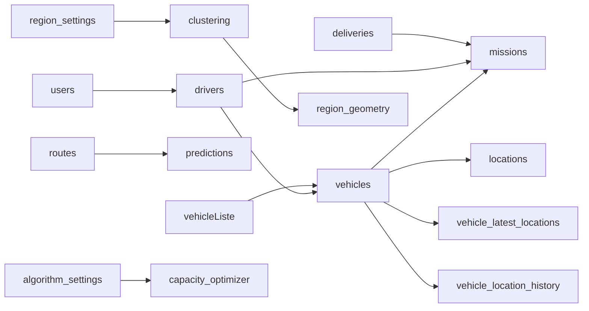

# SmartRoute - Collections de base de données et relations

Ce document décrit les collections MongoDB utilisées par SmartRoute et la manière dont elles sont liées entre elles.

## 1. Principe général

SmartRoute utilise MongoDB avec `PyMongo`.

Il n'y a pas de clés étrangères SQL au sens strict. Les relations sont réalisées par des champs de référence, principalement des `ObjectId` ou des identifiants métiers, puis sécurisées par :

- des validateurs JSON Schema dans `app/db/init_db.py`,
- des indexes pour accélérer les recherches,
- la logique métier dans les services.

## 2. Collections principales

### `users`

Contient les comptes applicatifs.

Champs importants :

- `name`
- `email`
- `password_hash`
- `role`
- `is_active`
- `created_at`
- `updated_at`

Relations :

- un `driver` peut être lié à un `user` via `login_user_id`.
- les utilisateurs sont utilisés pour l'authentification et les droits d'accès.

### `drivers`

Contient les conducteurs.

Champs importants :

- `full_name`
- `phone`
- `license_number`
- `availability`
- `assigned_vehicle_id`
- `login_user_id`
- `assignment_history`

Relations :

- `assigned_vehicle_id` référence un véhicule affecté au conducteur.
- `login_user_id` référence un utilisateur de type conducteur.
- un conducteur peut être affecté à une mission.

### `vehicles`

Contient les véhicules opérationnels.

Champs importants :

- `registration`
- `vehicle_list_id`
- `capacity_kg`
- `status`
- `avg_fuel_consumption`
- `created_at`
- `updated_at`

Relations :

- `vehicle_list_id` référence la collection `vehicleListe`.
- un véhicule peut être affecté à un conducteur.
- un véhicule peut être utilisé dans plusieurs missions au fil du temps.

### `vehicleListe`

Contient le référentiel des types de véhicules.

Champs importants :

- `nom`
- `image_url`
- `created_at`
- `updated_at`

Relations :

- `vehicles.vehicle_list_id` pointe vers cette collection.

### `deliveries`

Contient les livraisons à planifier et à exécuter.

Champs importants :

- `reference`
- `customer`
- `pickup_address`
- `pickup_address_lat`
- `pickup_address_lng`
- `dropoff_address`
- `dropoff_address_lat`
- `dropoff_address_lng`
- `status`
- `priority`
- `weight_kg`
- `vehicle_id`
- `driver_id`
- `scheduled_at`
- `delivered_at`
- `created_at`
- `updated_at`

Relations :

- `vehicle_id` référence le véhicule assigné.
- `driver_id` référence le conducteur assigné.
- une livraison peut être incluse dans une mission.

### `missions`

Contient les missions générées par le pipeline d'optimisation.

Champs importants :

- `driver_id`
- `vehicle_id`
- `region_id`
- `delivery_ids`
- `deliveries_order`
- `total_weight`
- `route_distance`
- `route_duration`
- `status`
- `polyline`
- `created_at`
- `scheduled_date`
- `updated_at`

Relations :

- `driver_id` référence le conducteur de la mission.
- `vehicle_id` référence le véhicule de la mission.
- `delivery_ids` contient la liste des livraisons incluses dans la mission.
- `deliveries_order` détaille l'ordre des étapes pickup/delivery.

### `routes`

Contient les itinéraires planifiés ou historiques.

Champs importants :

- `vehicle_id`
- `delivery_ids`
- `planned_path`
- `actual_path`
- `distance_km`
- `estimated_duration_min`
- `actual_duration_min`

Relations :

- `vehicle_id` référence le véhicule concerné.
- `delivery_ids` liste les livraisons liées à la route.

### `locations`

Contient l'historique brut des positions GPS.

Champs importants :

- `vehicle_id`
- `lat`
- `lng`
- `speed_kmh`
- `heading`
- `timestamp`

Relations :

- `vehicle_id` référence le véhicule suivi.

### `vehicle_latest_locations`

Contient la dernière position connue de chaque véhicule.

Champs importants :

- `vehicle_id`
- `latitude`
- `longitude`
- `timestamp`
- `created_at`
- `updated_at`

Relations :

- une seule ligne par véhicule est conservée.

### `vehicle_location_history`

Contient l'historique détaillé des positions d'un véhicule.

Champs importants :

- `vehicle_id`
- `latitude`
- `longitude`
- `timestamp`
- `created_at`

Relations :

- `vehicle_id` référence le véhicule suivi.

### `predictions`

Contient les prédictions de durée et de distance.

Champs importants :

- `route_id`
- `model_name`
- `model_version`
- `features`
- `predicted_duration_min`
- `predicted_distance_km`
- `confidence`
- `created_at`

Relations :

- `route_id` référence la route analysée.

### `region_settings`

Contient la configuration administrateur du clustering.

Champs importants :

- `n_clusters`
- `mode`
- `updated_by`
- `updated_at`

Relations :

- cette collection pilote le nombre de régions utilisé par `KMeansClusterer`.

### `region_geometry`

Contient les géométries calculées pour chaque région.

Champs importants :

- `region_id`
- `center_lat`
- `center_lng`
- `radius_km`
- `computed_at`

Relations :

- `region_id` correspond à l'identifiant de cluster calculé au moment de l'optimisation.
- ces données sont exposées pour l'affichage cartographique.

### `algorithm_settings`

Contient la configuration administrateur de l'algorithme d'affectation.

Champs importants :

- `algorithm_name`
- `is_active`
- `parameters`
- `updated_by`
- `updated_at`

Relations :

- cette collection détermine l'algorithme actif utilisé par `CapacityOptimizer`.

## 3. Relations fonctionnelles entre collections

### Authentification et utilisateurs

- `users` est la collection centrale pour l'identité applicative.
- `drivers.login_user_id` relie un conducteur à son compte utilisateur.

### Véhicules et conducteurs

- `drivers.assigned_vehicle_id` relie un conducteur à son véhicule.
- `vehicles.vehicle_list_id` relie un véhicule à son type de référence.

### Livraisons et missions

- `deliveries.driver_id` et `deliveries.vehicle_id` indiquent l'affectation opérationnelle.
- `missions.delivery_ids` regroupe toutes les livraisons d'une mission.
- `missions.deliveries_order` stocke l'ordre de passage exact.

### Géographie et optimisation

- `region_settings` détermine le nombre de régions à créer.
- `region_geometry` stocke les résultats de clustering pour affichage cartographique.
- `algorithm_settings` choisit l'algorithme d'affectation actif.

## 4. Contraintes et indexes

Les validators et indexes sont créés dans `app/db/init_db.py`.

Exemples de contraintes importantes :

- `users.email` est unique,
- `vehicles.registration` est unique,
- `drivers.license_number` est unique,
- `deliveries.reference` est unique,
- `region_geometry.region_id` est unique,
- `algorithm_settings.algorithm_name` est unique.

## 5. Schéma de lecture rapide

## 6. Résumé

SmartRoute repose sur des collections MongoDB liées par des références logiques plutôt que par des clés étrangères SQL.

Les relations les plus importantes sont :

- `drivers` vers `users` et `vehicles`,
- `deliveries` vers `drivers`, `vehicles` et `missions`,
- `missions` vers `deliveries`, `drivers` et `vehicles`,
- `region_settings`, `region_geometry` et `algorithm_settings` pour le pilotage administrateur de l'optimisation.
